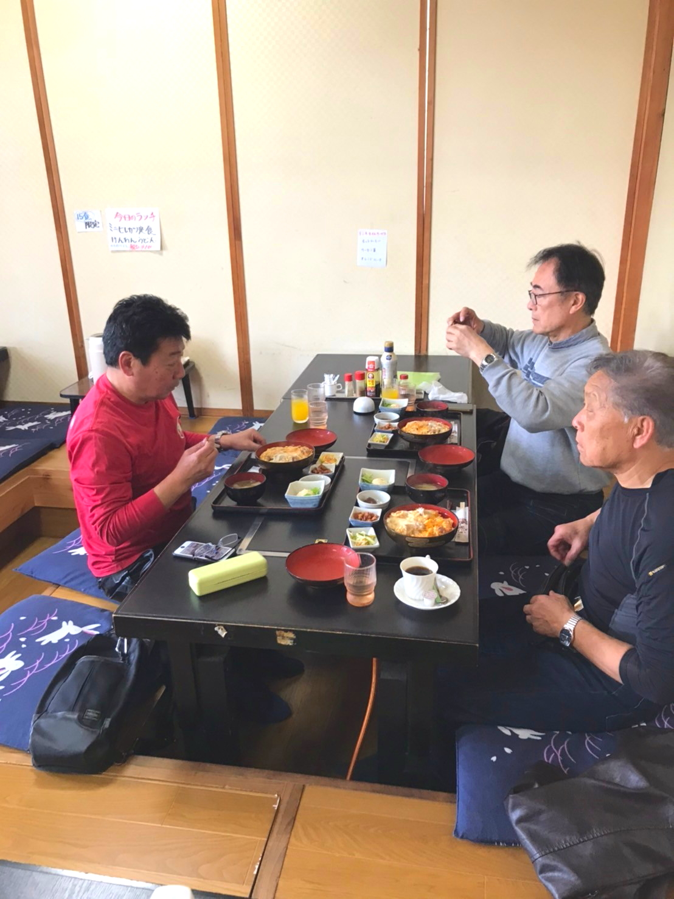
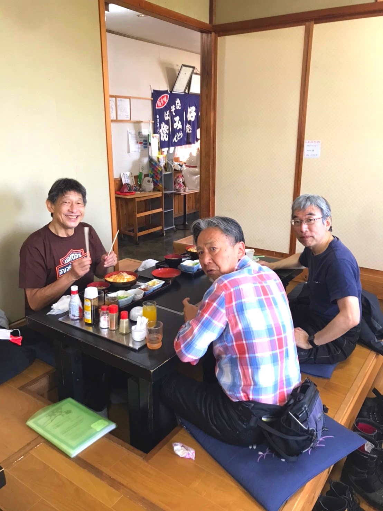

# 2024_touring

<html lang="ja">
 <head>
  <meta charset="utf-8" />
 

<link href="https://cdnjs.cloudflare.com/ajax/libs/lightbox2/2.7.1/css/lightbox.css" rel="stylesheet">
   
</head>
<!--
<body onload="alert('65歳まで、よく頑張りました！　まだまだ元気に〜〜(^o^)/')" onunload="alert('再会の時まで、元気でお過ごしくださいませ〜(^o^)/')">
-->

<h1><marquee behavior="alternate">!!! 2024Apr13_Mr.Hamada's_Touring !!!</marquee></h1><!--

<a href="https://torokoid.github.io/home">Home</a>><a href="https://torokoid.github.io/oizumi">2019年同期会</a>><a href="https://torokoid.github.io/kanreki">還暦祝い＠池袋</a>><a href="https://torokoid.github.io/shiba">写真集</a>>>><a href="https://torokoid.github.io/oizumi_jigo">鹿児島支部情報</a> 2024,同期会
-->

  モバイル端末をお使いの場合は、画面を横向きにするとより見やすくご覧頂けます。

<!--

 &nbsp;祝！65歳
-->
<!--
<h2><a href="https://torokoid.github.io/list">クラス会名簿リンク</a></h2>
-->
  

 アクセス用QRコード

<marquee direction="right" scrollamount="20" width="30%">(^_^)/~hada</marquee>

<h2><marquee behavior="alternate">!!! 2024年4月13日、浜田さんツーリング　!!!</marquee></h2>
<!--

-->

今回のルート

<a href="https://www.google.co.jp/maps/dir/36.5634515,140.0090162/〒329-1224+栃木県塩谷郡高根沢町上高根沢２３１３+安住神社/茨城県常陸大宮市鷲子２７２+道の駅+みわ/永福/''/水車館/道の駅+那須与一の郷/@36.7813139,139.9020371,10.3z/am=t/data=!4m40!4m39!1m1!4e1!1m5!1m1!1s0x6021e00f40d8313b:0x64996e7ae4dcef43!2m2!1d140.0298852!2d36.5912507!1m5!1m1!1s0x6021ebcc19aae757:0x32a530940f215efd!2m2!1d140.2800036!2d36.6558574!1m5!1m1!1s0x6021bf442d5941b9:0xdc039fa4969d3aca!2m2!1d140.3630317!2d36.7909481!1m5!1m1!1s0x6021b52b355386bd:0x4c2803a380f68253!2m2!1d140.3857406!2d37.0299048!1m5!1m1!1s0x60202d3c29ba7933:0x53813e43091899a8!2m2!1d140.1572922!2d36.9545634!1m5!1m1!1s0x6021d46efa1c92b5:0xe58f0f081c584a0f!2m2!1d140.0877217!2d36.8622289!3e0?hl=ja&entry=ttu" data-lightbox="abc"></a>

      

                             

                             
        

  

 

<!-- フッタ -->
 <footer>
 Copyright 2024/Apr/13 S.Hada 
 </footer>
